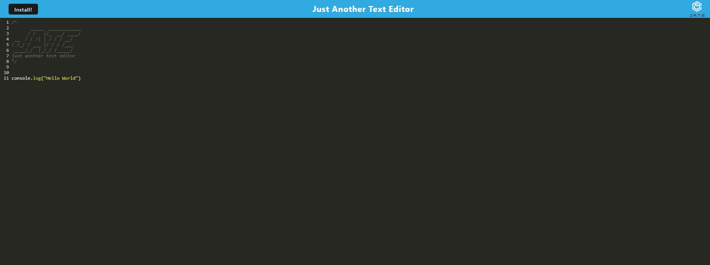

# 19 Progressive Web Applications (PWA): Text Editor

## Description

 The app will be a single-page application that meets the PWA criteria. Additionally, it will feature a number of data persistence techniques that serve as redundancy in case one of the options is not supported by the browser. The application will also function offline.

## Installation

To install necessary dependencies, run the following command:
npm i
npm run build

## Usage

When the application is cloned, the user will need to run an 'npm i' which will install the node modules for both the client and server sides. Then the user will type 'npm run build' into the terminal in order to create the dist folder. After that 'npm run start' will start the server on local host 3001. At this point the user will be able to use the app. When the user clicks the 'Install' button, they will download the web application as an icon on their desktop. If data wass entered into the text editor, they will see that displayed on their app.

## Screenshot

